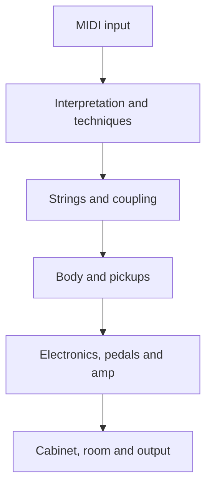

# Architecture

Luthier processes MIDI through interpretation and playing techniques, computes string pitch and excitation, and renders string, body and pickup response before passing the result through guitar electronics, pedals, amplifier, cabinet, room and master output. The engine uses per-string waveguides and sympathetic coupling. The body can use generated impulse responses or modal synthesis; the pickup includes position and electrical response.

Key directories: `Source/DSP/` contains signal processing, `Source/GUI/` the interface, `Source/Tests/` the test runner, `Tools/RenderCli.cpp` the offline renderer, `Resources/` factory content, and `packaging/` platform installers. CMake excludes `Source/WIP/` from plugin compilation.

The implementation entry points are [`spec/README.md`](https://github.com/djshellshoxxx/luthier/blob/master/spec/README.md) for the original architecture overview, [`spec/engine.md`](https://github.com/djshellshoxxx/luthier/blob/master/spec/engine.md) for DSP rules, [`spec/gui-integration.md`](https://github.com/djshellshoxxx/luthier/blob/master/spec/gui-integration.md) for UI placement, and [`spec/ui-wiring.md`](https://github.com/djshellshoxxx/luthier/blob/master/spec/ui-wiring.md) for parameter and backend attachment. The specs include proposed work; inspect the compiled source and tests before describing a detail as implemented.
